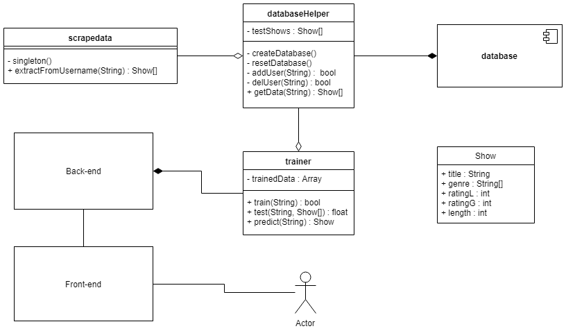

# The Witte Anime Recommender
## Goal
This project extracts data from a user's MyAnimeList (MAL) profile, including a list of shows and ratings, to train a neural network into predicting new shows for the user to watch.

**Current progress: Approximately 10%**

## Plan
This project will be broken down into a few different pieces. The goal of this segmentation is to have low coupling to allow each segment to be upgraded or fully exchanged if necessary.
For example, the [scrapedata.py](scrapedata.py) file can be run independently to extract a list of dictionaries containing rated watch data from a default account, or it can be used as a Python module to extract a specific user's data.

## Components
As of now, there are 6 planned components. This section provides a brief description of each and their current progress.
- **Front-end**: Limited
  - This component provides a way for users to interface with the system. Currently, the plan for this component is a simple website. There will be the ability to enter a MAL username, a "start" button, and a results section detailing the training's success rate and 1-3 shows as a prediction. A nice addition would be a progress bar, in the event that the user isn't already in the database.
  - Apache has been installed and websites load on my Raspberry Pi, but no progress beyond that.
- **Back-end**: Untouched
  - This back-end receives data from the front-end (ie, username) and transmits it to the trainer, while also receiving data from the trainer and resupplying the user with corresponding data.
  - No progress has been made or can really be planned for, as my understanding of "back-end" for websites is effectively nil. Once I learn what it is, the UML diagram might rotate to center around this component rather than the trainer.
- **Trainer**: Untouched
  - This component will use machine learning to evaluate watch data for a specific user to try and anticipate their preferences. It receives a username from the back-end, queries the database helper for data related to that user, and does its stuff. I am planning to use a neural network for training purposes, particularly ant-colony, because it's cool, but I should probably do research into this first.
  - No progress has been made thus far.
- **Database Helper**: Untouched
  - As an interface between the other components and a database, this component will likely see the most traffic despite having what I expect to be the lowest computational cost.
  - No progress yet.
- **Database**: Untouched
  - A system containing all extracted data, functioning as something akin to a cache so as to prevent the need for excessive datascraping. There will need to be a table for shows, a table for users, and a table for users' individual watch data.
    * The shows table will need to be detailed after further research.
    * The user table will contain: username (key identifier), cache data, and training data.
    * The watch table will consist of: username, show title, date completed, and score.
  - MySQL is installed, and further progress will likely happen at the same time as development on the database helped component.
- **Datascraper**: Mostly complete
  - The datascraper's sole job is to acquire data from MAL's website. It can download the watch data for a given user, or it can download the data for a singular show.
  - Largely functioning for user watch data scraping, but show data scraping is unimplemented. Currently at a 300-shows-per-user limit, due to javascript loading built into MAL.

## Future plan
Regardless of whether the full system winds up completed and functioning as described, each of the 6 components individually feature a new subject matter for me, and I'm considering each one its own project.
Datascraping will be completed first, simply because I started with it. Database Helper and the Database itself will be built semi-simultaneously once the datascraper is done. Then the trainer will be built to within a limited capacity (using Python ML libraries rather than coding the networks myself), before finally moving on to front- and back-end research.